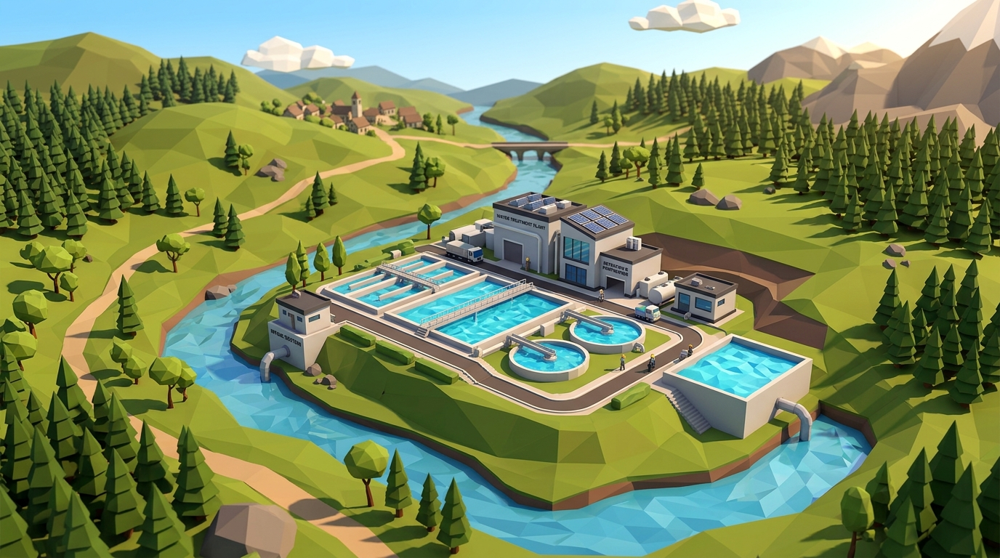

# 🌊 Sunol FlowLab — Drinking Water Plant Simulator

[](https://godotengine.org)
[](https://github.com/boxwrench/sunol-flowlab)
[](LICENSE)

An interactive, real-time, low-poly 3D simulation of a drinking water treatment plant built with **Godot 4.7** and **GDScript**. The engine is built from the ground up on strict, deterministic mass-balance and hydraulics rules, separating simulation logic from 3D presentation adapter layers.



---

## 🚀 Key Features

* **Deterministic G5 Flow Solver**: Implements a two-pass topological Directed Acyclic Graph (DAG) flow solver.
  * **Pass 1 (Request)**: Downstream process units request flow from upstream links, respecting link capacities and boundary limits.
  * **Pass 2 (Grant)**: Upstream units grant flows based on available withdrawable volumes, prioritizing `OUTLET` ports above the minimum operating volume and distributing remaining volumes to `DRAIN` ports.
* **Proportional Feedback Automation**: Equipped with proportional level controllers (`LevelController`) managing valve positions based on level error.
  * Features a configurable deadband (no-action threshold) to prevent valve oscillations.
  * Supports seamless **Bumpless Transfer** (tracking valve openings in manual mode to avoid output spikes when transitioning to auto mode).
* **Interactive 3D Presentation**: Exposes live 3D visual adapters linked to simulation state snapshots:
  * Water surfaces dynamically rise and fall representing reservoir/basin volume levels.
  * Control valves rotate to reflect physical actuator positioning.
  * Asset Selection panel displaying real-time PV (Process Variable), setpoint, gain, deadband, mode state, and command overrides.
* **Mass Balance Integrity (INV-1)**: Continually verifies the conservation of mass. All flows and storage volumes are ledgered, asserting if any water is unaccounted for or if any storage volume drops below zero.

---

## 📐 System Architecture

Sunol FlowLab strictly adheres to a **Sim/Presentation separation** model:

```
  ┌──────────────────────────────────────────────────────────┐
  │                   Presentation Layer                     │
  │  (3D Meshes, Visual Adapters, Orbit Camera, TimeControls) │
  └──────────────────────────┬───────────────────────────────┘
                             │ Reads Snapshots / Sends Commands
                             ▼
  ┌──────────────────────────────────────────────────────────┐
  │                    Simulation Engine                     │
  │  (SimulationClock, CommandQueue, SimulationContext)      │
  └──────────────────────────┬───────────────────────────────┘
                             │ Runs 14-Step Tick Process
                             ▼
  ┌──────────────────────────────────────────────────────────┐
  │                      Domain Logic                        │
  │  (StorageUnit, FlowLink, SimValve, SimController)         │
  └──────────────────────────┬───────────────────────────────┘
```

The core simulation model operates entirely using **SI units** (m³, m³/s, meters, seconds) to ensure precision and mathematical consistency. Conversion to US customary units (MGD, MG, feet) is performed strictly at the presentation/UI boundary.

---

## 🚰 Simulated Process Train

The default plant (`headworks_area.tscn`, config `phase3_headworks`) models the headworks
and sedimentation stages — reservoirs through the applied channel. Downstream filtration
and disinfection are planned (see `docs/ROADMAP.md`, Phase 4) and are represented here by a
single filter-feed boundary that draws treated flow away.

```
  EXTERNAL_SOURCE_01     EXTERNAL_SOURCE_02
          │                      │
          ▼                      ▼
    RESERVOIR_01           RESERVOIR_02
          └──────────┬───────────┘
                     ▼
                 MANIFOLD_01            (inlet manifold)
                     │
                     ▼
                FLASH_MIX_01            (coagulant flash mix)
                     │
                     ▼
                 DIST_BOX_01            (splits flow five ways)
          ┌─────┬─────┼─────┬─────┐
          ▼     ▼     ▼     ▼     ▼
       BASIN_01 … … … … … BASIN_05    (sedimentation / flocculation)
          └─────┴─────┼─────┴─────┘
                      ▼
             APPLIED_CHANNEL_01         (combines basin effluent)
                      │
                      ▼
              FILTER_FEED_01            (treated-demand boundary; stands in
                                         for the future filter train)
```

Reservoir and basin drains discharge to a shared `DRAIN_SINK`; over-elevation storage
discharges to `SPILL_SINK`. A smaller three-unit demo (`three_unit_train.tscn`) is also
included for inspecting the closed-loop level controller in isolation.

---

## 🛠️ Getting Started

### Prerequisites
* [Godot Engine 4.7 (stable)](https://godotengine.org/download) installed on your system path.

### Running the Simulator
1. Clone the repository:
   ```bash
   git clone https://github.com/boxwrench/sunol-flowlab.git
   cd sunol-flowlab
   ```
2. Open the project in Godot:
   * Import the project folder containing `project.godot`.
3. Play the plant:
   * Press **Play** to run the default scene, `res://scenes/plant/headworks_area.tscn` — the full headworks-and-sedimentation plant. Select assets, toggle auto/manual controller modes, command setpoints, and take basins in and out of service.
   * Or open `res://scenes/plant/three_unit_train.tscn` for the smaller three-unit level-control demo, or `res://scenes/application/main.tscn` for the single-basin prototype.

---

## 🧪 Test Suite

The project includes unit, invariant, and integration tests using **GUT (Godot Unit Testing)**.

To execute the test runner headlessly in your CLI:
```bash
godot --headless -s addons/gut/gut_cmdln.gd -gdir=res://tests -ginclude_subdirs -gexit
```

### CI/CD Verification
GUT tests are executed in a GitHub Actions runner on every push. The suite includes:
* **Sanity Checks**: Ensuring all GDScript files compile and load cleanly.
* **Flow Solver Verification**: Testing boundary limit proration, outlet priority, and mass ledger behavior.
* **Automation Checks**: Verifying LevelController deadbands, clamps, and bumpless transfer.
* **100k-Tick Soak Tests**: Running continuous simulation runs under highly volatile random demand sweeps to prove no mass is leaked or destroyed over extended runs.

---

## 📚 Documentation Index

Find detailed specifications and design records in the `docs/` folder:

| File | Description |
|---|---|
| 📑 [INDEX.md](docs/INDEX.md) | Authority hierarchy for project documents. |
| 📐 [REPOSITORY_ARCHITECTURE.md](docs/REPOSITORY_ARCHITECTURE.md) | Standard file layout, layering rules, and the 14-step simulation tick. |
| ⚖️ [SIMULATION_RULES.md](docs/SIMULATION_RULES.md) | Fixed-step mechanics, mass balance tracking, and flow proration equations. |
| 🎮 [CONTROL_LOGIC.md](docs/CONTROL_LOGIC.md) | Auto/Manual control mode rules, deadbands, and flow splitting. |
| 📄 [PROCESS_UNIT_CONTRACTS.md](docs/PROCESS_UNIT_CONTRACTS.md) | Standard properties and states of storage units, ports, links, and actuators. |
| 🏷️ [TAG_NAMING.md](docs/TAG_NAMING.md) | Syntax conventions for equipment tags and process variables. |
| 📏 [INTERNAL_UNITS.md](docs/INTERNAL_UNITS.md) | SI standard internal units vs Customary US display formatting. |
