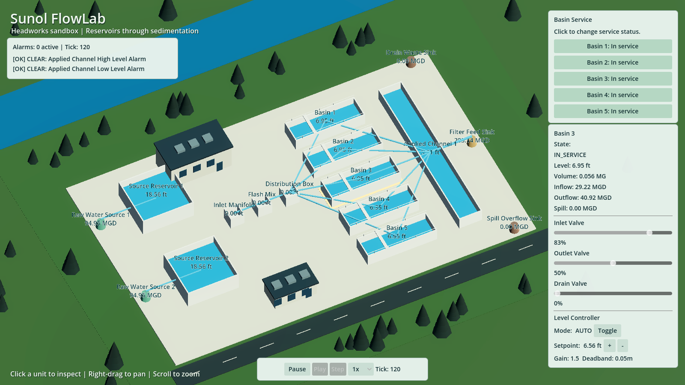
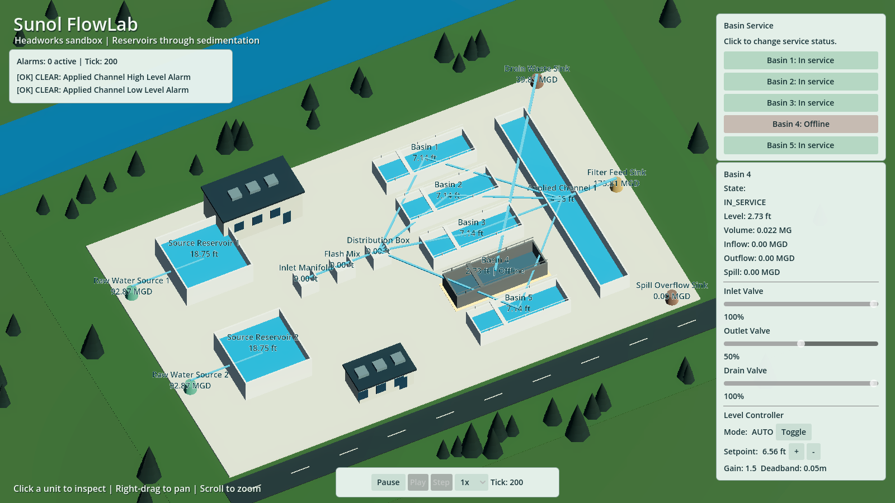

# Headworks visual preview

User-requested presentation pass, 2026-10-01. The existing banner is a mood reference:
low-poly concrete structures, bright water and green surroundings. These screenshots
are the actual Godot main scene, not concept art or the banner placed behind the UI.
This pass is not WP4.7 and does not close the Phase 3 / WP4.1 audit gate.





## Delivered

- A compact site with two raw-water reservoirs, five open basins and the applied channel.
  Native Godot meshes form concrete walls, access bridges and simple railings; there are
  no new third-party downloads or runtime asset dependencies.
- Static operations buildings, service road, trees, hills and a scenic river. These are
  illustrative context, not additional modeled process units or connected water bodies.
- Snapshot-driven water surfaces, levels, offline labels and flow bars. Display scales
  and zero-flow behavior are declared in `PRESENTATION_MAPPING.md`.
- An oblique orthographic camera: right/middle drag or WASD/arrows to pan, scroll to zoom.
  Left-click selects a unit, highlights its footprint and updates the inspector.
- Separate service controls, alarm panel and compact inspector. The selected basin's
  controller is associated through its driven actuator, so its AUTO mode and setpoint
  remain visible even when the controller measures the common applied channel.

The presentation-map changes reuse existing schema fields. No hydraulic config fields,
equations, capacities, storage volumes, initial conditions or controller tuning changed.
The supplied GLB models remain available through the existing custom-mesh interface;
the default preview uses native open geometry to keep water visible.

## Changed files

- `scripts/presentation/headworks/`: site scenery, basin geometry, selection, camera,
  snapshot-driven flow visibility and presenter selection routing.
- `scripts/application/headworks_area_bootstrap.gd`: connects selection to the inspector.
- `scripts/ui/controllers/asset_panel.gd` and `basin_service_panel.gd`: compact readouts,
  controller association, readable service labels and a concrete command-bus reference.
- `scenes/plant/headworks_area.tscn`, `scenes/environment/placeholder_environment.tscn`,
  `scenes/ui/`: camera/site composition, lighting, shared theme and panel layout.
- `project.godot`: 1600×900 logical viewport with a 1280×720 default window.
- `config/plants/phase3_headworks/presentation_map.json`: compact placement and removal
  of the default blueprint/custom placeholder meshes; custom-mesh support remains tested.
- `tests/unit/presentation/test_presentation_adapter.gd`: production water/flow mappings
  and main-scene selection/controller integration.
- `tools/verification/capture_visual_preview.gd`, screenshots and documentation.
- `tools/ci/run_tests.sh`: WP4.6 follow-up, normalizes Windows CRLF before checking the
  loaded-script count. A WSL invocation exposed the carriage return in the numeric token;
  the runner correctly rejected it rather than silently accepting an unverifiable count.

## Reproduce the visual checks

Use a graphical Godot 4.7 build from the repository root:

```sh
godot --path . --resolution 1600x900 --rendering-method gl_compatibility \
  -s tools/verification/capture_visual_preview.gd
```

The harness advances the production engine to tick 120, captures the running site,
injects a real viewport click on Basin 4 and verifies the inspector selection, then
sends production service/drain commands and captures tick 200. Rendering uses snapshots;
the harness does not implement any hydraulic behavior.

Executed on Godot 4.7.stable.official.5b4e0cb0f, GUT 9.7.0, Windows and OpenGL Compatibility.
Both captures saved successfully and viewport picking passed. Images were visually
inspected: water and labels are readable, the controller shows AUTO, panels fit, and
the offline basin has a reduced water level, grey walls and an explicit text cue.

## Executed test evidence

The final shared-runner execution returned exit 0:

```text
Derived test-script count: 34 (tests/**/test_*.gd)
Scripts              34
Tests               109
Passing Tests       109
Asserts           513398
Time              165.722s
---- All tests passed! ----
Loaded test-script count: 34
Verified 34 of 34 test scripts; Godot exit status 0.
```

Collected **109**, passed **109**, failed **0**. GUT omits the failing-test row when
zero. The real 100k-tick soak and availability-churn tests, replay, mass conservation,
nonnegative-storage, startup, alarms and headless/visual parity all executed.
`verify_test_runner.sh` passed **9** real-GUT guardrail cases with **0** failures;
its temporary fixtures were removed. Config validation exited 0 with **17** valid
JSON files accepted and **6** invalid fixtures rejected. The Godot editor import and
`git diff --check` passed; edited file endings were checked for truncation.

## Limits and remaining work

This is an initial visual direction, not a reconstruction of Sunol or the banner.
Terrain and equipment remain simple; junction labels can crowd at some zoom levels.
Flow bars depict logical links rather than installed pipe routing. The scenic river
does not animate and does not represent a simulated river flow. No water-quality or
settling-performance visuals were added. Filters, clearwell and disinfection are not
built. WP4.7 remains open.

Existing shutdown diagnostics remain: the scene reports 129 ObjectDB instances and
6 resources in use at exit; the first full run reports 4,937 instances and 6 resources.
The added main-scene integration test instantiates another production context, exposing
the existing cleanup issue again. This task does not resolve that lifecycle limitation.
